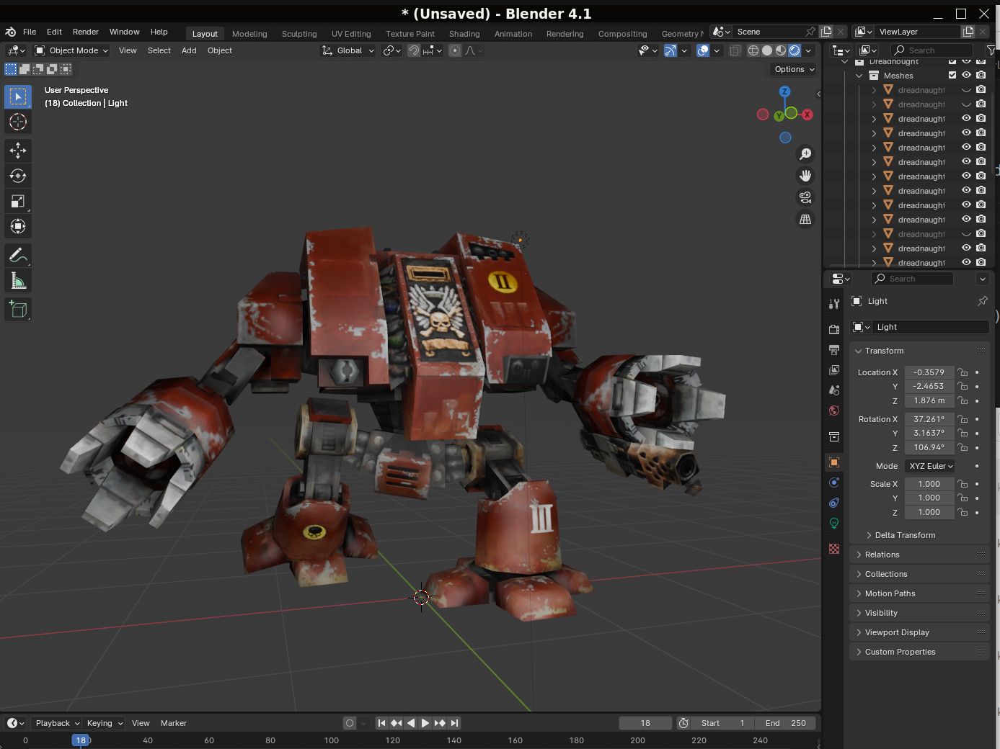

# Blender Dawn of War Addon
Blender addon for import and export of Dawn of War models.  

## Key features
- **Import and Export Functionality**: Supports the Dawn of War model format(`.whm`), including meshes, textures, bones, markers and animations.
* **Object Editor support**: Allows export to Object Editor model format(`.sgm`) so you can configure the unit properties, e.g. motions and actions.
- **Built-in conversion of textures**: Automatically imports `.rsh` texture files, including all additional layers, and exports all of them back.

## Installation
1. Make sure your Blender version is 4.4 or newer.
2. Download the latest release from the [Releases page](https://github.com/amorgun/blender_dow/releases/).
3. Drag and drop the archive into Blender and click `OK`
4. Go to `Edit -> Preferences -> Add-ons`, find `Dawn of War Import/Export` there and set up the `Mod folder` option to the path to your mod.
5. Restart Blender

## Import
1. Open your mod with [Corsix's Mod Studio](https://modstudio.corsix.org/)
2. Find and unpack the model `.whm` file (usually located at `Data/art/ebps/races/<race>/troops`)
3. Unpack `.rsh` files with model textures  (usually located at `Data/art/ebps/races/<race>/texture_share`)  
  If you missed some textures you can unpack them later following the error messages from the addon.
4. Tick the checkbox to enable the newly installed addon.
5. In Blender go to `File -> Import -> Dawn of War model (.whm)` and select your `.whm` file.

## Export
Often a simple `File -> Export -> Dawn of War model (.whm)` is enough.  
[This tutorial](docs/export.md) describes the full process of exporting and adding a new model into DoW.

## Links
### [First steps](./docs/first_steps.md) - how to install the addon and import a model from DoW into Blender
### [Exporting a model](./docs/export.md) - step-by-step tutorial on how to optimize a model and put it into DoW
### [FAQ](./docs/faq.md) - Frequently Asked Questions

## Troubleshooting
Ensure you are using Blender 4.4 or newer.  
The addon reports some messages that you can find in [Info Editor](https://docs.blender.org/manual/en/latest/editors/info_editor.html).  
In case it doesn't help feel free to [file an issue](https://github.com/amorgun/blender_dow/issues).

## Acknowledgments
- [Santos Tools](https://web.archive.org/web/20140916035249/http://forums.relicnews.com/showthread.php?76791-Santos-Tools) - original import script for 3ds Max.
- [Relic-Game-Tool](https://github.com/ModernMAK/Relic-Game-Tool) - another script for parsing relic chunky files and importing models to Blender.
- [Dawn of War Texture Tool](https://skins.hiveworldterra.co.uk/Downloads/detail_DawnOfWarTextureTool.html) - detailed info on RSH file structure.
- [Mudflaps WHM Model Converter Tool](https://web.archive.org/web/20140914165503/http://forums.relicnews.com/showthread.php?116040-WHM-Model-Converter-Tool)

## Disclaimer
Not affiliated with Sega, Relic Entertainment, or THQ.
