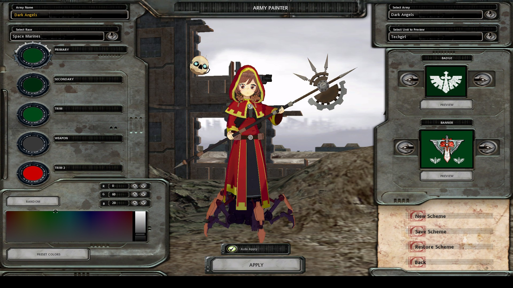

# Exporting a model

Here I'll show steps on how to export [this](https://sketchfab.com/3d-models/anime-girl-tech-priest-umm-warhammer-40000-ca349371124b4523b1cb59cc8fd99c1c) model from blender to DoW.  

1. **Open the model**
    1. Download [the model](https://sketchfab.com/3d-models/anime-girl-tech-priest-umm-warhammer-40000-ca349371124b4523b1cb59cc8fd99c1c)
    2. Import the model to Blender.  
    Go to `File -> Import -> glTF` and select the model.
    3. Remove `Plane` and `Book` meshes.
2. **Reduce vertex count**  
    DoW uses 16 bits for vertex indices, so you cannot have more than 65536 vertices per mesh.  
    In practice, DoW fails much earlier at about 8K vertices per mesh and 30K vertices in total in my experience.  
    A typical DoW model uses about 5K vertices for all meshes together.  
    In the case of this model, the main offender is the `Body` mesh with 115K polygons.  
    Blender offers a lot of options for reducing polygon count. Here I used the simplest ones:
    1. Manually remove extra vertices  
        Many meshes in the model actually consist of 2 layers of polygons. You need to select and remove extra layers.  
        - Select the mesh
        - Go to Materials
        - Select `FullBlack` or `FullBlack.001` material and click the Select button
        - Delete selected vertices

        For the `Body` mesh it's a good idea to instead remove vertices with Body material and then switch material for the remaining slot from `FullBlack.001` back to `Body` and flip all face normals of the mesh. This way you can save small details like eyelashes.   
        Additionally you can remove parts of `Body` hidden by other meshes.
    2. Add `Decimate` modifiers  
        For the majority of meshes you can simply add a `Decimate` modifier and set the Ratio to about 0.2.
        It is also required that all polygons are triangular, so add a `Triangulate` modifier as well.  
        You can use vertex groups to limit a Decimate modifier to a part of the mesh, e. g. keep face detailed while affecting the rest of the `Body` mesh.
3. **Remove unnecessary materials**  
    Go through the mesh list and remove `FullBlack` and `FullBlack.001` materials.  
    The addon cannot export them because they don't have an image and the model looks fine without them.
4. **Export the model to `.sgm`**  
    Go to `File -> Export -> Dawn of War Object Editor model (.sgm)`.  
    You can uncheck "Convert Textures" to avoid warnings about attempted conversion to `.rsh`.
5. **Convert textures**  
    Since the original model uses `.png` textures and the addon can only convert .dds you need to convert them to `.rsh` manually.  
    By default the textures are exported into the folder with the same name as the exported model.
    1. Resize and convert to `.dds`
      The original model uses textures of size 1024x1024, and Object Editor really doesn't like it.  
      I'm using ImageMagick here, but there are probably other ways:  
      `ls -1 -I info.txt | xargs -I % convert % -resize 512 %.dds`
    2. Copy .dds textures into the appropriate location inside `DataGeneric` mod folder (e.g. `art/ebps/races/space_marines/texture_share`). Check `info.txt` in the exported textures folder for the correct locations.
    3. Use [Texture Tool](https://skins.hiveworldterra.co.uk/Downloads/detail_DawnOfWarTextureTool.html) to convert copied `.dds` textures to `.rsh`.
6. **Create `.whe`**
    1. Put the exported .sgm file inside the `DataGeneric` mod folder and open it with Object Editor
    2. Follow [this tutorial](https://web.archive.org/web/20071016120753/http://ageofsquat.com/mod_tutorials/idle_and_move.html) and setup the default action with idle motion.
7. **Export the model to `.whm`**  
 Go to `File -> Export -> Dawn of War model (.whm)`.
8. **Put converted textures, `.whm` and `.whe` files into your mod folder**  
    I put the resulting `techgirl.whm` and `techgirl.whe` into `Data/art/ebps/races/space_marines/troops`.  
    Copy converted `.rsh` textures into the  appropriate location. Check `info.txt` in the exported textures folder near the `.whm` file for the correct locations.
9. **Configure DoW to show your model in Army Painter**
    1. Open your mod with [Corsix's Mod Studio](https://modstudio.corsix.org/)
    2. Add an entity to `Data/attrib/ebps/races/space_marines/troops`  
        You can copy an existing file and change `entity_blueprint_ext - animator` value to `Races/Space_Marines/Troops/techgirl`  
        Also set `ui_info - screen_name_id` value to `Techgirl` and  the data type to `Text`
    3. Edit `space_marine_race.rgd`.  
        Find `Data/attrib/racebps/space_marine_race.rgd` and set `teamcolour_preview - entity_03` value to `techgirl`.
