# Frequently Asked Questions
### Table of Contents
1. [Why does my imported model not have textures in Blender?](#why-does-my-imported-model-not-have-textures-in-blender)
1. [Does the addon work with the Definitive Edition?](#does-the-addon-work-with-the-definitive-edition)
1. [Where can I get the latest version of the addon?](#where-can-i-get-the-latest-version-of-the-addon)
1. [Can you model/texture/animate a unit for me?](#can-you-modeltextureanimate-a-unit-for-me)
1. [Where can I find the addon tools?](#where-can-i-find-the-addon-tools)
1. [I've edited a `.whm` file. How can I update the `.whe` for it?](#ive-edited-a-whm-file-how-can-i-update-the-whe-for-it)
1. [Why do I have a pink cube instead of my model in-game?](#why-do-i-have-a-pink-cube-instead-of-my-model-in-game)
1. [Why is my model pink in-game?](#why-is-my-model-pink-in-game)
1. [Why are some parts of my model invisible in-game?](#why-are-some-parts-of-my-model-invisible-in-game)
1. [Why do my exported textures use `space_marine` path? How can I change it?](#why-do-my-exported-textures-use-space_marine-path-how-can-i-change-it)
1. [Manually copying exported textures to my mod is tedious. Is there a simpler way?](#manually-copying-exported-textures-to-my-mod-is-tedious-is-there-a-simpler-way)
1. [How do I edit textures using this addon?](#how-do-i-edit-textures-using-this-addon)
1. [How to correctly set up a material nodes?](#how-to-correctly-set-up-a-material-nodes)
1. [How to add a badge or a banner to the model?](#how-to-add-a-badge-or-a-banner-to-the-model)
1. [How to make a reflective texture?](#how-to-make-a-reflective-texture)
1. [Why does my exported model have more vertices than the original?](#why-does-my-exported-model-have-more-vertices-than-the-original)
1. [How can I make my model fit the Army Painter window?](#how-can-i-make-my-model-fit-the-army-painter-window)
1. [What does the force_invisible mesh flag do?](#what-does-the-force_invisible-mesh-flag-do)
1. [How do I create `vis_` animations?](#how-do-i-create-vis_-animations)
1. [What does the Stale bone flag do?](#what-does-the-stale-bone-flag-do)
1. [How do I create `aim` animations?](#how-do-i-create-aim-animations)
1. [Can I use IK or cloth simulation for my models?](#can-i-use-ik-or-cloth-simulation-for-my-models)
1. [How to set up IK so it's easier to export it later?](#how-to-set-up-ik-so-its-easier-to-export-it-later)
1. [How can I make animated textures (e.g., tank tracks/chainswords)?](#how-can-i-make-animated-textures-eg-tank-trackschainswords)
1. [How to make a mesh invisible mid-animation?](#how-to-make-a-mesh-invisible-mid-animation)
1. [How to make a model partially transparent?](#how-to-make-a-model-partially-transparent)
1. [What is `Force Skinning`](#what-is-force-skinning)
1. [How can I copy an action from one model to another?](#how-can-i-copy-an-action-from-one-model-to-another)
1. [How can I copy a mesh from one model to another?](#how-can-i-copy-a-mesh-from-one-model-to-another)
1. [Where can I see some example models?](#where-can-i-see-some-example-models)
1. [How can I learn more about DoW modding?](#how-can-i-learn-more-about-dow-modding)
1. [How can I help this project?](#how-can-i-help-this-project)
1. [My question is not listed here. Where can I ask it?](#my-question-is-not-listed-here-where-can-i-ask-it)

## Why does my imported model not have textures in Blender?
It means the addon cannot find your texture files.  
Almost always it is caused by the **Mod folder** not being [set up correctly](./first_steps.md#configuration).  
Go to `Edit -> Preferences -> Add-ons -> Dawn of War Import/Export`, click on the **"Setup using .module"** button and select your mod's .module file.  


## Does the addon work with the Definitive Edition?
Yes. The addon supports the new `.whm`+`.rtx` scheme and exports both the new `.whm`+`.rtx` as well as the old `.whm` + `.rsh` schemes, both of which work in DE.

## Where can I get the latest version of the addon?
Visit the [**Releases page**](https://github.com/amorgun/blender_dow/releases/) for the latest stable and dev versions.

## Can you model/texture/animate a unit for me?
No. In fact, I'm quite bad at the actual modeling part, so I'm making tools for the people who are good at it.
But if you have a finished model in Blender chances are I can give you some pointers on how to put it into DoW.

## Where can I find the addon tools?
The addon adds new panels  **in the Sidebar of the 3D Viewport and Shader Editor**.  They provide useful info and tools to make common operations easier.
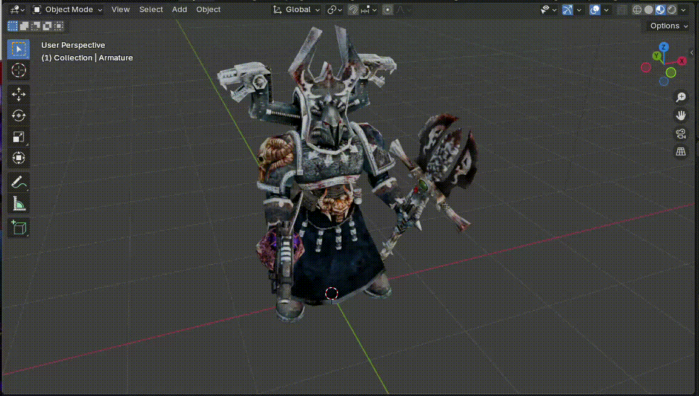


## I've edited a `.whm` file. How can I update the `.whe` for it?
I've made a [standalone tool](https://github.com/amorgun/dow_utils/tree/main/object_tool) for this purpose.  
With it you can either:
- Convert the `.whe` to `.ebp` and edit it with the Object Editor
- Convert the `.whe` to plain text, edit it with your favorite text editor, and convert it back to `.whe`

## Why do I have a pink cube instead of my model in-game?
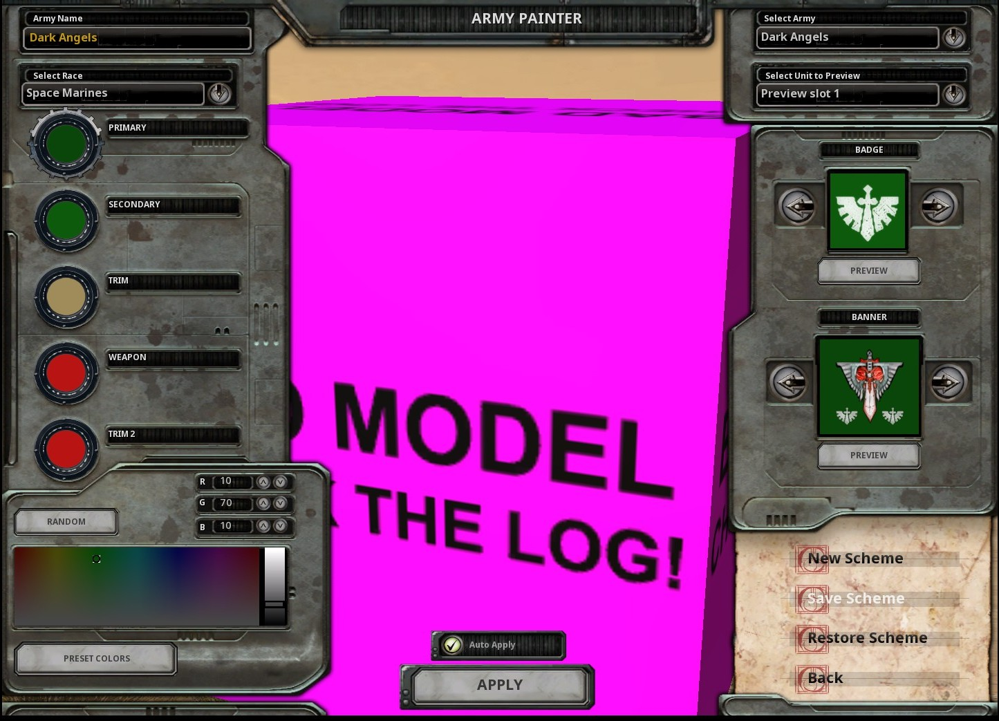
Possible reasons for it:
1. You didn't copy the model to the same location you specified in the unit `.rgd`.  
    Check your `warnings.log` to identify the missing file
    ```
   RENDER ANIM -- Art/EBPs/Races/Space_Marines/Troops/preview_slot_1: Unable to open file!
    ```
2. The model is corrupted.  
  If the addon encountered errors during export the model may be incorrectly exported.  
  Check Blender messages for any errors and see if it's possible to reimport the exported model back into Blender.

## Why is my model pink in-game?
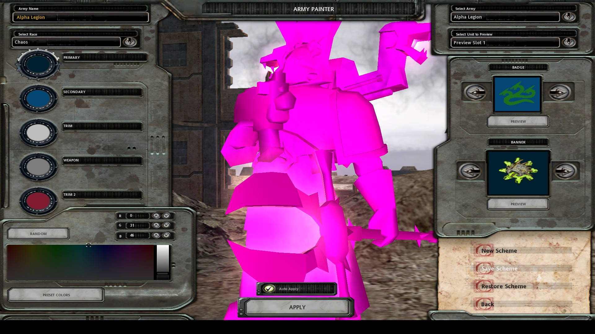
It happens when DoW cannot load the model textures. Usually it means you forgot to copy a `.rsh` file to the mod folder or you put it into the wrong location.  
Check `warnings.log` inside the DoW folder to find the offending file.
It should have rows like this:
```
RENDER ANIM -- 'art/ebps/races/chaos/texture_share/chaos_sorcerer_unit': Unable to open file!
RENDER ANIM -- 'art/ebps/races/chaos/texture_share/chaos_sorcerer_weapons': Unable to open file!
```

## Why are some parts of my model invisible in-game?
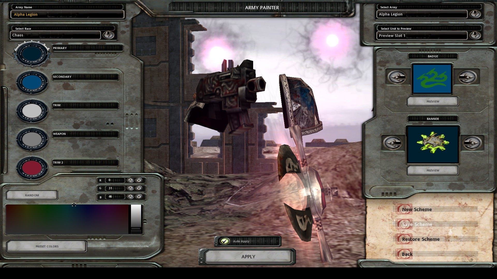
It usually means your mesh has too many polygons.
The simplest way to optimize your mesh is the `Autosplit mesh` operator. It will split the complex mesh into several simpler ones based on its Weight Painting. Such meshes are much cheaper on the engine.
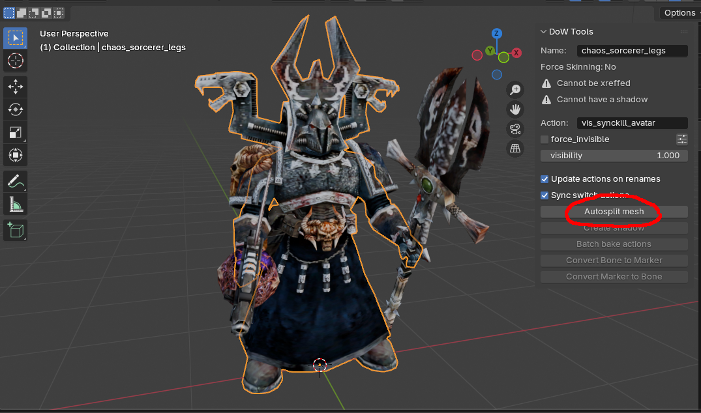

## Why do my exported textures use `space_marine` path? How can I change it?
Depending on the texture format, the addon uses the following parameters to determine the exported path:
1. **DE `.rtx` textures**
    1. **`Single Image Path`** value for the image. You need to select an Image Texture Node in the Shader Editor to set the value for its image.
   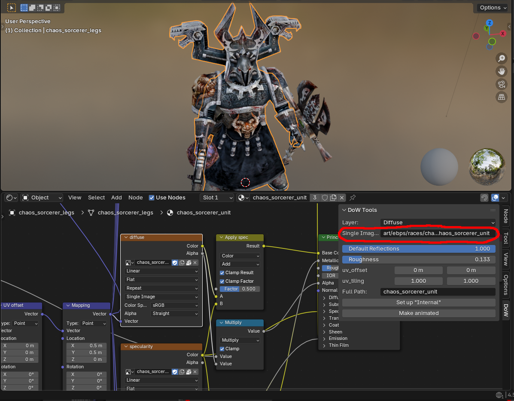
    2. **`Full Path`** value plus the layer suffix.
     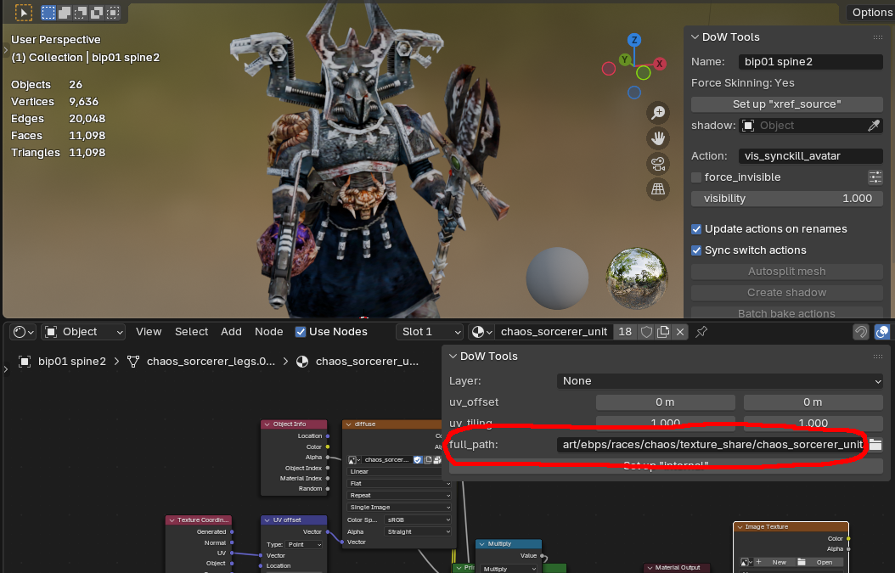
    3. **`Default texture folder`** in the Export dialogue is used for materials without either `Single Image Path` or `Full Path`
   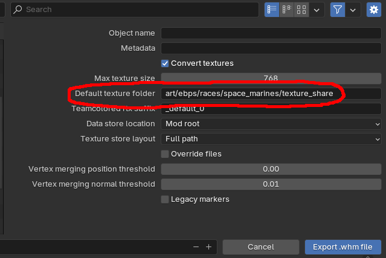
2. **Vanilla `.rsh` textures**
    1. **`Full Path`** value for the material
    2. **`Default texture folder`** in the Export dialogue is used for materials without a `Full Path`

You can use **`Single Image Path`** and **`Full Path`** to make multiple models share the same image file.

## Manually copying exported textures to my mod is tedious. Is there a simpler way?
Yes, you can select `Texture store layout = Full path` in the export dialogue. It will create the same nested folder structure as it expects from the mod folder. Then you can copy it to your mod folder with the `Merge` option selected to automatically put everything into the correct places.  You can also copy it into your `DataGeneric` folder to make it work with the Object Editor.  
You can go further and select `Data store location = Mod root` to automatically put all exported files into your mod. But be careful because it can override existing files there.  
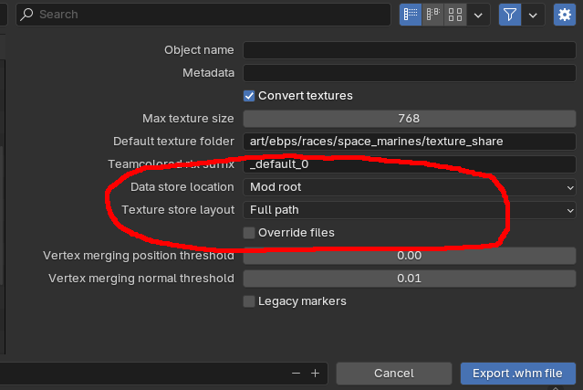  
There is also the `Custom Folder` option that allows you to manually specify the root folder to export your textures. It can be useful when working with the Object Editor to automatically put the files into the `DataGeneric` folder.

## How do I edit textures using this addon?
The addon treats a material as a collection of `Image Texture` nodes. The images from matching nodes are exported into several files.  
The addon uses the node label to identify the role of an image. The most convenient way to set it is to use the `Layer` selector on the addon tools panel.  
There are also some heuristics to infer an image role based on the node connections, but it's very fragile and I recommend using explicit labels.  
You can edit images as usual, either by using  Blender texture painting or an external image editor. Take note that the addon packs texture images when importing a model, so you'll need to unpack them for editing with an external editor.
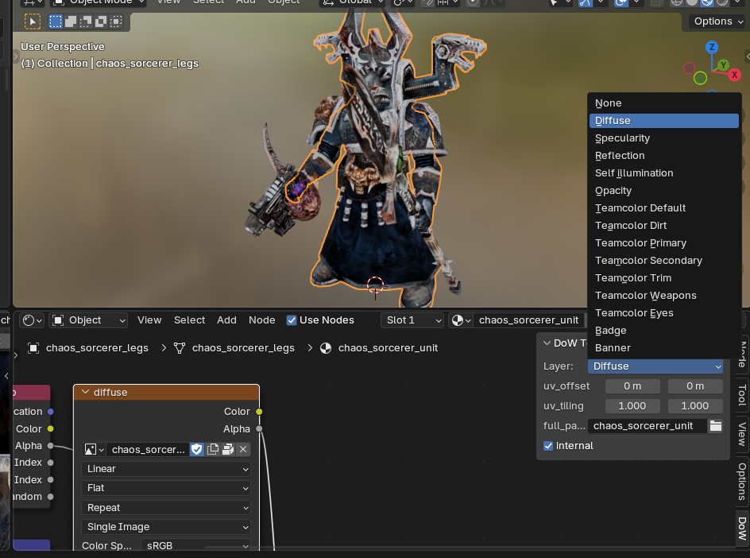

## How to correctly set up a material nodes?
Add your image layers to the material and use the **`"Re-create node tree" operator`**. It automatically detects available layers and creates the nodes and connections.
You can also use this operator to add teamcolor nodes to non-teamclored materials.
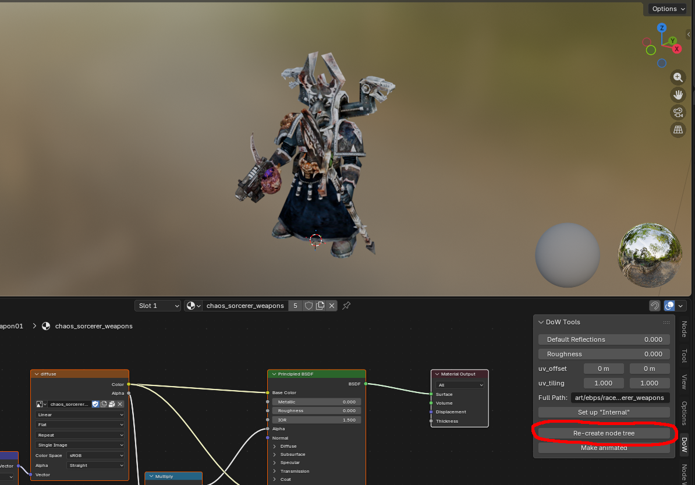

## How to add a badge or a banner to the model?
Here are the steps for a badge. The banner steps will be the same.
1. Re-create the material node tree with teamcolor enabled
2. Locate the "UNUSED_badge" node and change its layer to "Badge"
3. Select a badge image in the node
4. Adjust values at the "badge_position" and "badge_display_size" nodes.  
  You can drag a value in Blender to smoothly change it.
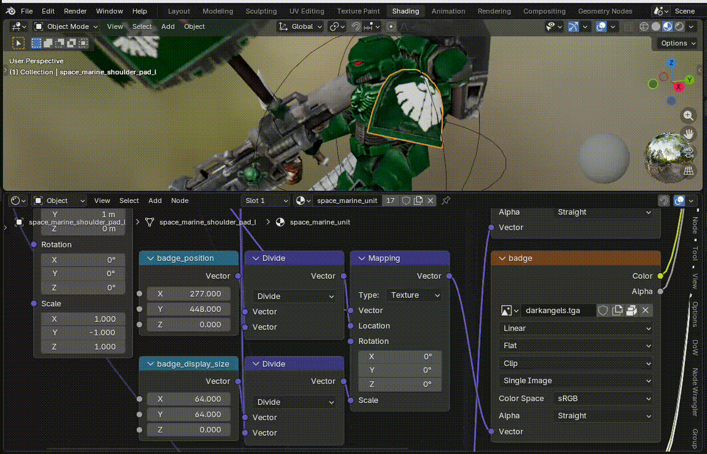

## How to make a reflective texture?
There are 3 main parts of a reflective material in DE:
1. Material Roughness value  
    This value defines how sharp the reflected image is.  
    The engine only supports a singular Roughness value per material, so you cannot use a roughness map image.  
    Setting Roughness to 0 disables the reflection system for the material.  
    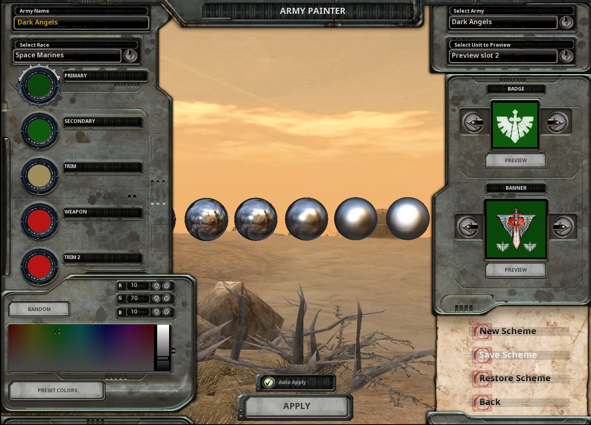
2. Specular Layer image  
    This image is added to the Diffuse color based on the reflection strength.  
    To avoid making the resulting color too bright you might want to make the reflective areas darker at the Diffuse Layer.  
    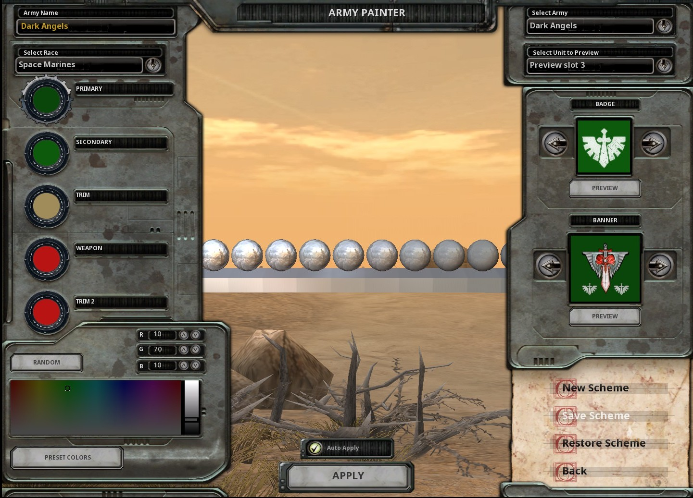
3. Default reflection value  
    It's not clear how this value works, but it appears to be a multiplier for the Specular Layer color.  
    The base game models most commonly use values of 0 or 1.  
    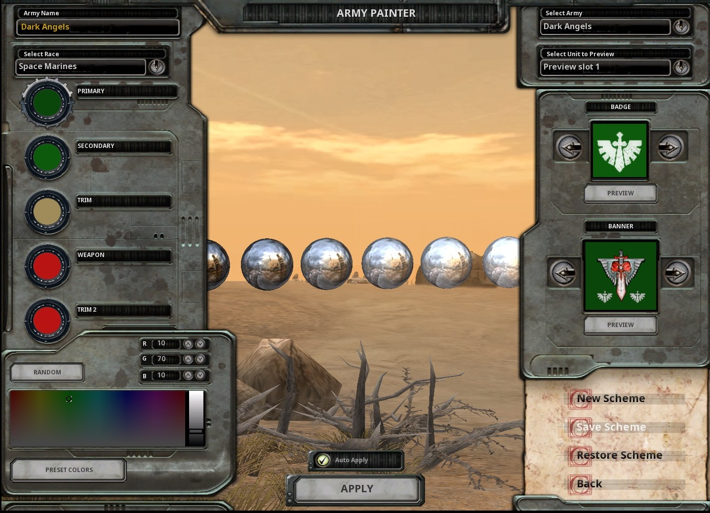

## Why does my exported model have more vertices than the original?
It happens because DoW models allow a vertex to have exactly one UV position and corner normal. This means if a vertex belongs to either a UV seam or a Sharp Edge, it needs to be duplicated.
Here are two different UV unwrapping methods with duplicated vertices marked:
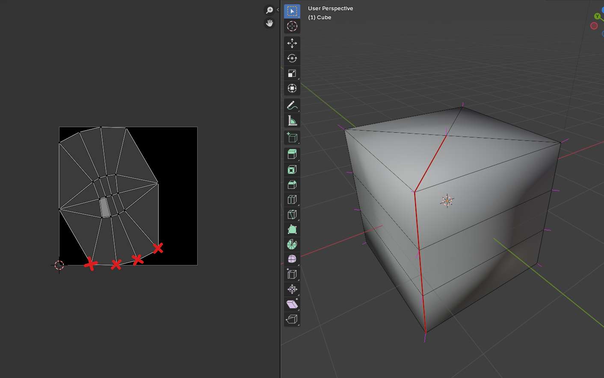
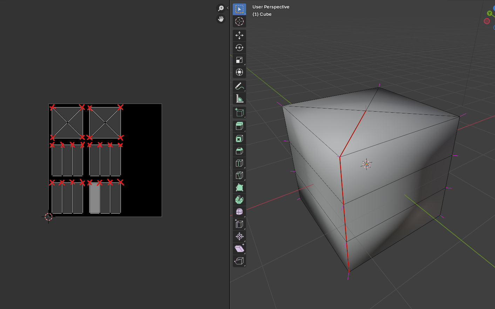

## How can I make my model fit the Army Painter window?
DoW looks for the `army_painter_camera` camera. The camera position defines the distance to the model, and the camera focus is used as the rotation center.  
You can copy the camera setup from `art/ebps/races/space_marines/troops/space_marine.whm` or configure it yourself.
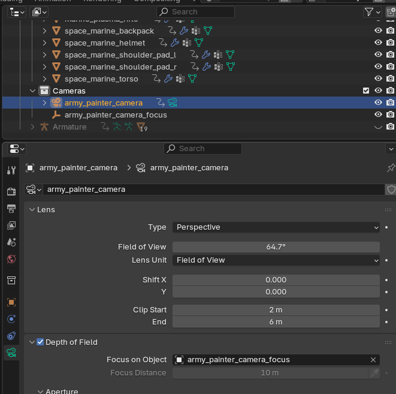

## What does the `force_invisible` mesh flag do?
`force_invisible` flag determines if the mesh is visible in the action. When a model is playing multiple Actions at the same time, the mesh is visible if at least one of the current Actions has the `force_invisible` flag for this mesh set to `false`.  
This system often used to create `vis_` animations that contain only `force_invisible` data. Then the `.whe` is configured to play `vis_` animations on top of other animations to control mesh display in-game based on some conditions.  
You can check [this tutorial](https://web.archive.org/web/20071016120849/http://ageofsquat.com/mod_tutorials/vis_groups.html) for more details.

## How do I create `vis_` animations?
You need to set the `force_invisible` flag for your meshes. Select the mesh, then select the action in the Action Editor and set the flag using the checkbox on the addon tools panel.  
There is also a Batch Configure operator so you can set `force_invisible` for all selected meshes across multiple actions.  
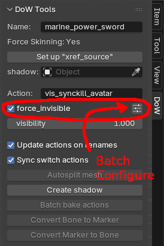

## What does the `Stale` bone flag do?
Stale flag used when the engine needs to mix multiple animations. An example is mixing aim animation with whatever the unit is currently doing.  
In order to determine each bone transform the engine looks at each animation and chooses the bone transform from the first animation where this bone is not marked as Stale.  

To change the Stale flag:
1. Select the Armature
2. Go to Pose Mode
3. Select an Action
4. Select a bone
5. Use the `stale` checkbox on the addon tools panel

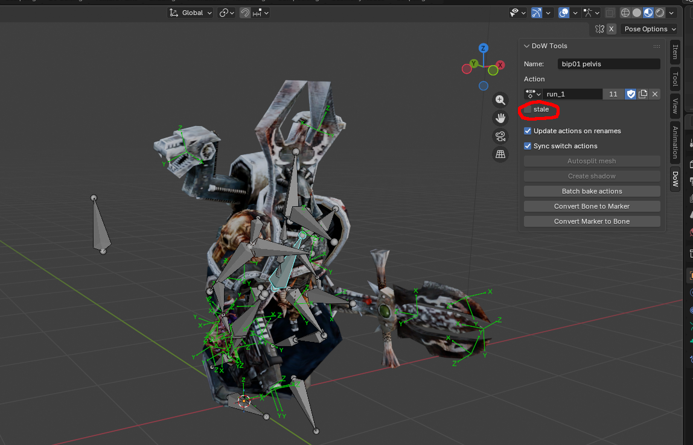

## How do I create `aim` animations?
First of all, you need to create the bone animation. It usually looks like a 36-frame-long action with a single bone rotating from -180 to 180.  
Then you must correctly mark bones as `stale`. If a bone has this flag in the action, it won't override the position and location set for this bone by other actions the model currently plays.  
Usually, it's enough to mark every bone except the one rotating as `stale`.  
You can quickly do it by selecting all bones first using the `A` key and **Alt + click** on the `stale` checkbox on the addon tools panel to mark all bones as `stale`. Then select the one rotating bone and unmark it as `stale`.  
Make sure to use different bones for horizontal and vertical aim.
Also, check [this tutorial](https://web.archive.org/web/20071016120841/http://ageofsquat.com/mod_tutorials/tracking_and_firing.html) for more details.

## Can I use IK or cloth simulation for my models?
Yes, but you'll need to bake it to bone animation before exporting. The addon provides the batch-baking operator to streamline this process.  
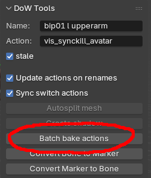

## How to set up IK so it's easier to export it later?
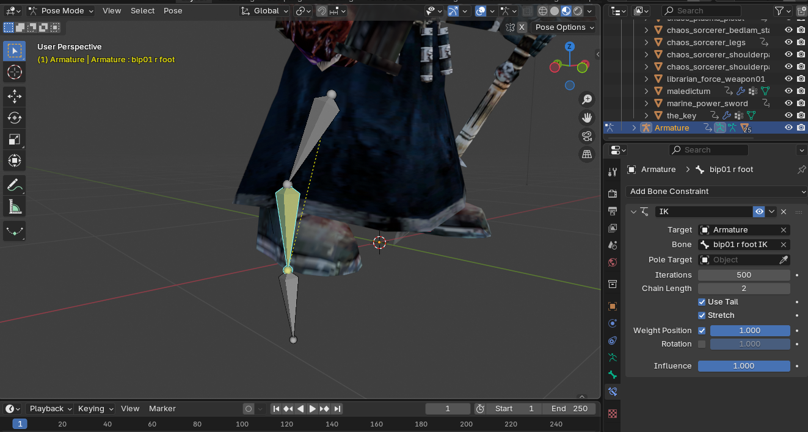
I recommend adding additional IK bones that are used as IK constraint targets without their own Weight Painting.  
This way you can keep the original parent relations and remove this IK bone after baking your animations.

## How can I make animated textures (e.g., tank tracks/chainswords)?
First of all, you need to set an action for your animated material.
Use the `Make Animated` operator on the DoW Addon panel in the Shader Editor.
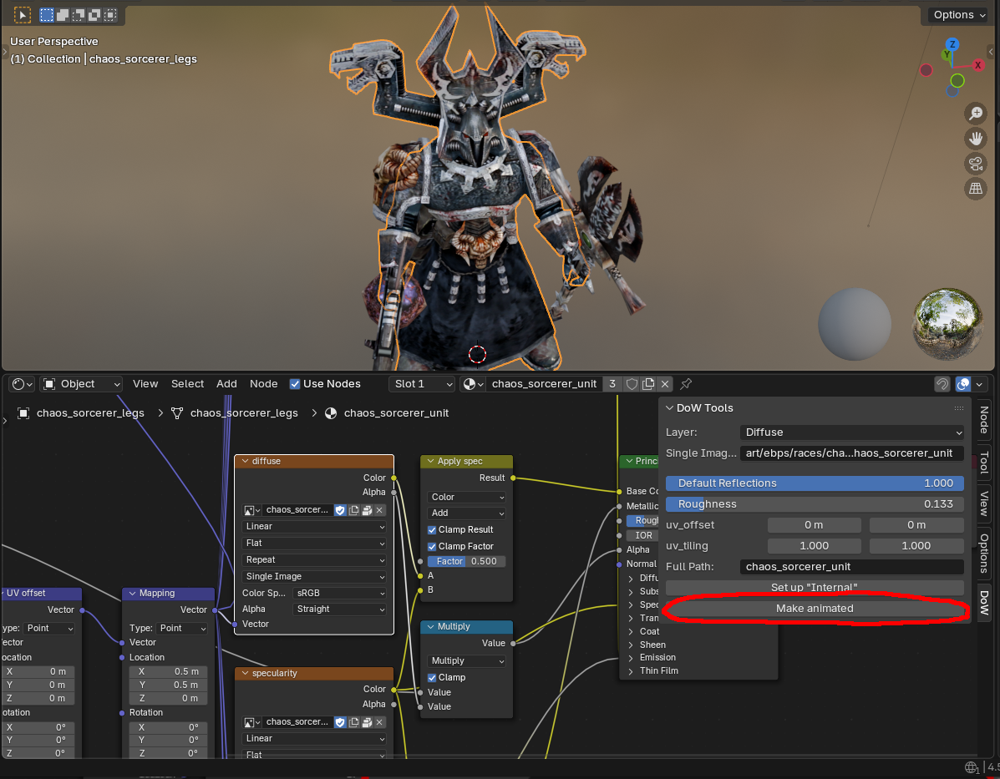

Then you can animate the `UV-offset` property on the addon tools panel in the Shader Node window.  
Keyframe it the same way you keyframe any other property.  

**WARNING**: If you have multiple animated materials make sure they use different Action Slots, or they will end up sharing animation data.


## How to make a mesh invisible mid-animation?
Use the `visibility` option of the mesh. You can keyframe it just like any other property.  
The engine only supports binary transparency for animated meshes, so values between 0 and 1 will be thresholded.

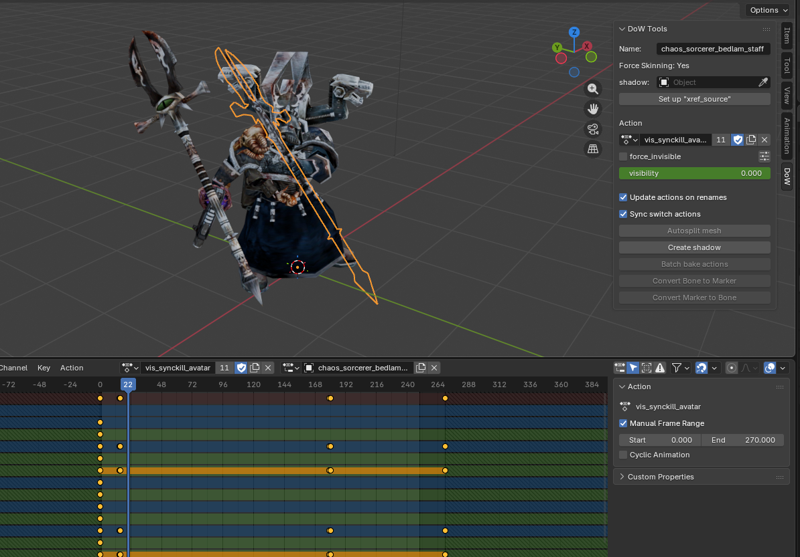

## How to make a model partially transparent?
The game engine only allows binary transparency for unit and building models. If you want to make some meshes partially transparent you can use a [Mesh FX](https://web.archive.org/web/20250506121358/https://dow.finaldeath.co.uk/rdnwiki/www.relic.com/rdn/wiki/DOWFXTool/RingEffect%26v=72p.html):
1. Create a new model in Blender and use textures with an alpha channel for it.
2. Create a Mesh FX from the new model.
3. Attach the new FX to your model by connecting it to a marker in the unit `.whe` file.

## What is `Force Skinning`?
A mesh is Force Skinned when it's fully attached to a single bone. It can use either Weight Painting or parenting to the bone.  
This provides a couple of advantages:
1. Force-Skinned meshes are extremely cheap for the DoW engine, so you can get huge meshes to work in-game
2. It helps reduce the size of the exported file.
`Force Skinning` is detected automatically and you can see it on the addon tools panel:  

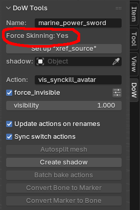

In case your model has Bone Weight Painting set up you can use the **`Autosplit mesh`** operator to automatically extract as many Force Skinned meshes as possible without changing the appearance of your mesh.  


## How can I copy an action from one model to another?
In case the models share the same skeleton you can do the following:
1. Open the source model and save it as a `.blend` file.
2. Open the target model, click `File - Append` and select the source `.blend` file and the action you want to copy.

You can also xref an animation from another model in the `.whe` file.

## How can I copy a mesh from one model to another?
There are two ways:
1. Copy the mesh in Blender
  You can either copy-paste it or use Append. This will result in the model having its own copy of the mesh data.
2. Xref mesh from another file
  Copy a mesh in Blender and specify the `xref_source` value. This way, the mesh won't be exported and instead will be included from the `xref_source` file.

## Where can I see some example models?
It's a good idea to look at the base-game models to see how they are made.  
The addon aims to keep the model the same after import-export so feel free to choose a model and see how it ticks.

## How can I learn more about DoW modding?
Take a look at [**my collection of tutorial links**](https://github.com/amorgun/dow_utils/blob/main/articles/links.md). I've also composed [**an index of DoW file formats**](https://github.com/amorgun/dow_utils/blob/main/articles/files.md). 

## How can I help this project?
Here are a few ideas:
- Make some cool stuff for your mod and inspire more people to get into DoW modding
- Make a tutorial or a video showcasing your pipeline for working with the add-on
- Suggest new features and report bugs
- Leave a ⭐star⭐ for this repository to keep me motivated to keep working on it

## My question is not listed here. Where can I ask it?
The best way to do it is to [open a new issue](https://github.com/amorgun/blender_dow/issues/new) in this repository.  
I also usually answer on Discord and ModDB, but I like issues better because they are easier to search.
