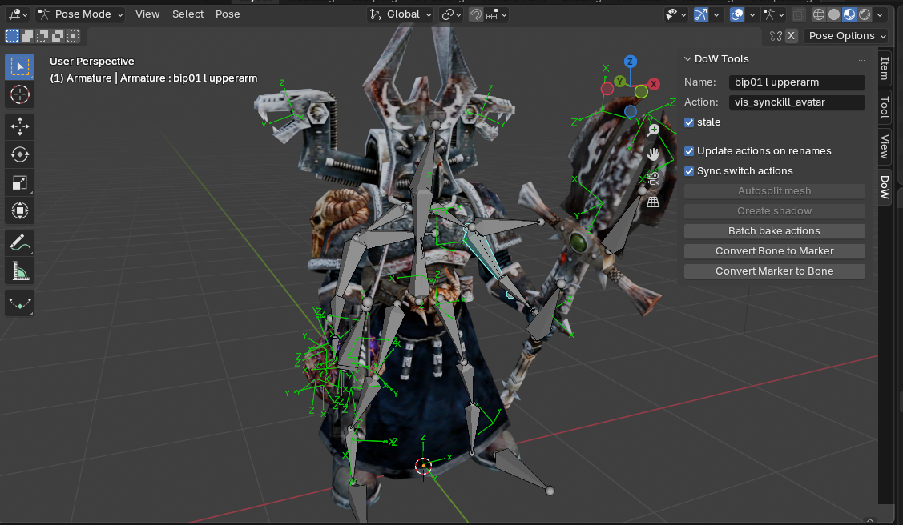

# Frequently Asked Questions
### Table of Contents
1. [Why does my imported model not have textures in Blender?](#why-does-my-imported-model-not-have-textures-in-blender)
1. [Does the addon work with the Definitive Edition?](#does-the-addon-work-with-the-definitive-edition)
1. [Where can I get the latest version of the addon?](#where-can-i-get-the-latest-version-of-the-addon)
1. [Can you model/texture/animate a unit for me?](#can-you-modeltextureanimate-a-unit-for-me)
1. [Where can I find the addon tools?](#where-can-i-find-the-addon-tools)
1. [I've edited a `.whm` file. How can I update the `.whe` for it?](#ive-edited-a-whm-file-how-can-i-update-the-whe-for-it)
1. [Why is my model pink in-game?](#why-is-my-model-pink-in-game)
1. [Why are some parts of my model invisible in-game?](#why-are-some-parts-of-my-model-invisible-in-game)
1. [Why do my exported textures use `space_marine` path? How can I change it?](#why-do-my-exported-textures-use-space_marine-path-how-can-i-change-it)
1. [Manually copying exported textures to my mod is tedious. Is there a simpler way?](#manually-copying-exported-textures-to-my-mod-is-tedious-is-there-a-simpler-way)
1. [How do I edit textures using this addon?](#how-do-i-edit-textures-using-this-addon)
1. [Why does my exported model have more vertices than the original?](#why-does-my-exported-model-have-more-vertices-than-the-original)
1. [How can I make my model fit the Army Painter window?](#how-can-i-make-my-model-fit-the-army-painter-window)
1. [How do I create `vis_` animations?](#how-do-i-create-vis_-animations)
1. [How do I create `aim` animations?](#how-do-i-create-aim-animations)
1. [Can I use IK or cloth simulation for my models?](#can-i-use-ik-or-cloth-simulation-for-my-models)
1. [How to set up IK so it's easier to export it later?](#how-to-set-up-ik-so-its-easier-to-export-it-later)
1. [How can I make animated textures (e.g., tank tracks/chainswords)?](#how-can-i-make-animated-textures-eg-tank-trackschainswords)
1. [What is `Force Skinning`](#what-is-force-skinning)
1. [How can I copy an action from one model to another?](#how-can-i-copy-an-action-from-one-model-to-another)
1. [Where can I see some example models?](#where-can-i-see-some-example-models)
1. [How can I learn more about DoW modding?](#how-can-i-learn-more-about-dow-modding)
1. [How can I help this project?](#how-can-i-help-this-project)
1. [My question is not listed here. Where can I ask it?](#my-question-is-not-listed-here-where-can-i-ask-it)

## Why does my imported model not have textures in Blender?
It means the addon cannot find your texture files.  
Almost always it's caused by the **Mod folder** not being [set up correctly](./first_steps.md#configuration).  
Go to `Edit -> Preferences -> Add-ons -> Dawn of War Import/Export`, click on the **"Setup using .module"** button and select your mod's .module file.  


## Does the addon work with the Definitive Edition?
Yes. The addon supports the new `.whm`+`.rtx` scheme and exports both new `.whm`+`.rtx` as well as the old `.whm` + `.rsh` schemes, both of which work in DE.

## Where can I get the latest version of the addon?
Visit the [**Releases page**](https://github.com/amorgun/blender_dow/releases/) for the latest stable and dev versions.

## Can you model/texture/animate a unit for me?
No. In fact, I'm quite bad at the actual modeling part, so I'm making tools for the people who are good at it.
But if you have a finished model in Blender chances are I can give you some pointers on how to put it into DoW.

## Where can I find the addon tools?
The addon adds new panels  **in the Sidebar of 3D Viewport and Shader Editor**.  They provide useful info and tools to make common operations easier.


## I've edited a `.whm` file. How can I update the `.whe` for it?
I've made a [standalone tool](https://github.com/amorgun/dow_utils/tree/main/object_tool) for this purpose.  
With it you can either:
- Convert the `.whe` to `.ebp` and edit it with Object Editor
- Convert the `.whe` to plain text, edit it with your favorite text editor, and convert it back to `.whe`

## Why is my model pink in-game?

It happens when DoW cannot load the model textures. Usually it means you forgot to copy a `.rsh` file to the mod folder or you put it into the wrong location.  
Check `warnings.log` inside the DoW folder to find the offending file.
It should have rows like this:
```
RENDER ANIM -- 'art/ebps/races/chaos/texture_share/chaos_sorcerer_unit': Unable to open file!
RENDER ANIM -- 'art/ebps/races/chaos/texture_share/chaos_sorcerer_weapons': Unable to open file!
```

## Why are some parts of my model invisible in-game?

It usually means your mesh has too many polygons.
The simplest way to optimize your mesh is the `Autosplit mesh` operator. It will split the complex mesh into several simpler ones based on its Weight Painting. Such meshes are much cheaper on the engine.


## Why do my exported textures use `space_marine` path? How can I change it?
Depending on the texture format, the addon uses the following parameters to determine the exported path:
1. **DE `.rtx` textures**
    1. **`Single Image Path`** value for the image. You need to select an Image Texture Node in the Shader Editor to set the value for its image.
   
    2. **`Full Path`** value plus the layer suffix.
     
    3. **`Default texture folder`** in the Export dialogue is used for the materials without either `Single Image Path` or `Full Path`
   
2. **Vanilla `.rsh` textures**
    1. **`Full Path`** value for the material
    2. **`Default texture folder`** in the Export dialogue is used for the materials without `Full Path`

You can use **`Single Image Path`** and **`Full Path`** to make multiple models share the same image file.

## Manually copying exported textures to my mod is tedious. Is there a simpler way?
Yes, you can select `Texture store layout = Full path` in the export dialogue. It will create the same nested folder structure as it expects from the mod folder. Then you can copy it to your mod folder with the `Merge` option selected to automatically put everything into the correct places.  You can also copy it into your `DataGeneric` folder to make it work with the Object Editor.  
You can go further and select `Data store location = Mod root` to automatically put all exported files into your mod. But be careful because it can override existing files there.  


## How do I edit textures using this addon?
The addon treats a material as a collection of `Image Texture` nodes. The images from matching nodes are exported into several files.  
The addon uses the node label to identify the role of an image. The most convenient way to set it is to use the `Layer` selector on the addon tools panel.  
There are also some heuristics to infer an image role based on the node connections but it's very fragile and I recommend using explicit labels.  
You can edit images as usual, either by using  Blender texture painting or an external image editor. Take note that addon packs textures when importing a model so you'll need to unpack it for editing with an external editor.


## Why does my exported model have more vertices than the original?
It happens because DoW models allow a vertex to have exactly one UV position and corner normal. It means if a vertex belongs to either a UV seam or a Sharp Edge it needs to be duplicated.
Here are two different UV unwrapping methods with duplicated vertices marked:


## How can I make my model fit the Army Painter window?
DoW looks for `army_painter_camera` camera. The camera position defines the distance to the model, and the camera focus is used as the rotation center.  
You can copy the camera setup from `art/ebps/races/space_marines/troops/space_marine.whm` or configure it yourself.


## How do I create `vis_` animations?
You need to set the `force_invisible` flag for your meshes. Select the mesh, then select the action in the Action Editor and set the flag with the checkbox on the addon tools panel.  
There is also a Batch Configure operator so you can set `force_invisible` for all selected meshes across multiple actions.  


## How do I create `aim` animations?
First of all, you need to create the bone animation. It usually looks like a 36-frame-long action with a single bone rotating from -180 to 180.  
Then you must correctly mark bones as `stale`. If a bone has this flag in the action it won't override the position and location set for this bone by other actions the model currently plays.  
Usually it's enough to mark every bone except the one rotating as `stale`.  
You can quickly do it by selecting all bones first with the key `A` and Alt + click on the `stale` checkbox on the addon tools panel to mark all bones as `stale`. Then select the one rotating bone and unmark it as `stale`.  
Make sure to use different bones for horizontal and vertical aim.
Also, check [this tutorial](https://web.archive.org/web/20071016120841/http://ageofsquat.com/mod_tutorials/tracking_and_firing.html) for more details.


## Can I use IK or cloth simulation for my models?
Yes, but you'll need to bake it to bone animation before exporting. The addon provides the batch-baking operator to streamline this process.  


## How to set up IK so it's easier to export it later?

I recommend adding additional IK bones that are used as IK constraint targets without their own Weight Painting.  
This way you can keep the original parent relations and remove this IK bone after baking your animations.

## How can I make animated textures (e.g., tank tracks/chainswords)?
First of all, you need to set an action for your animated material.
Use `Make Animated` operator on the DoW Addon panelin the Shader Editor


Then you can animate the `UV-offset` property on the addon tools panel in the Shader Node window.  
Keyframe it the same way you keyframe any other property.  


## What is `Force Skinning`?
The mesh is Force Skinned when it's fully attached to a single bone. It can use either Weight Painting or parenting to the bone.  
This provides a couple of advantages:
1. Force-Skinned meshes are extremely cheap for the DoW engine so you can get huge meshes to work in-game
2. It helps reduce the size of the exported file
`Force Skinning` is detected automatically and you can see it on the addon tools panel:  


In case your model has Bone Weight Painting set up you can use the **`Autosplit mesh`** operator to automatically extract as many Force Skinned meshes as possible without changing the appearance of your mesh.  


## How can I copy an action from one model to another?
In case the models share the same skeleton you can do the following:
1. Open the source model and save it as a `.blend` file
2. Open the target model, click `File - Append` and select the source `.blend` file and the action you want to copy.

## Where can I see some example models?
It's a good idea to look at the base-game models to see how they are made.  
The addon aims to keep the model the same after import-export so feel free to choose a model and see how it ticks.

## How can I learn more about DoW modding?
Take a look at [**my collection of tutorial links**](https://github.com/amorgun/dow_utils/blob/main/articles/links.md). I've also composed [**an index of DoW file formats**](https://github.com/amorgun/dow_utils/blob/main/articles/files.md). 

## How can I help this project?
Here are a few ideas:
- Make some cool stuff for your mod and inspire more people to get into DoW modding
- Make a tutorial or a video showcasing your pipeline for working with the add-on
- Suggest new features and report bugs
- Leave a ⭐star⭐ for this repository to keep me motivated to keep working on it

## My question is not listed here. Where can I ask it?
The best way to do it is to [open a new issue](https://github.com/amorgun/blender_dow/issues/new) in this repository.  
I also usually answer on Discord and ModDB, but I like issues better because they are easier to search.
