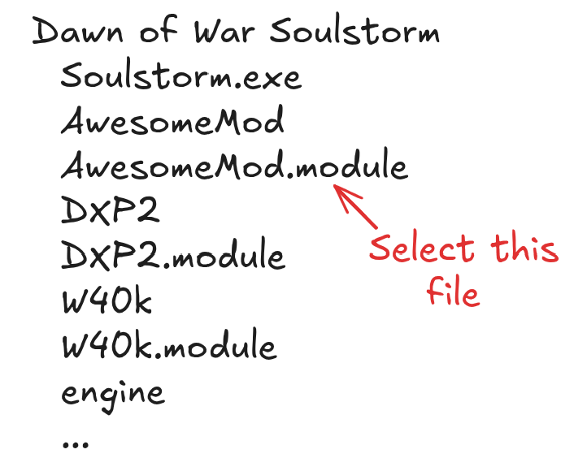

# First steps
In this tutorial you'll learn how to set up the DoW Blender Add-on and import your first model in Blender.

## Installation
First of all, you need to download and install the addon:
1. Download the latest addon .zip archive from [the Releases page](https://github.com/amorgun/blender_dow/releases).
2. Launch Blender.
3. Drag the addon archive into the Blender window.

4. Select "OK" in the pop-up window in Blender.

## Configuration
After you've installed the addon you need to open Add-on properties and configure the "**Mod folder**" for the addon.  

Here I assume you have your mod installed and available in the game. It's not strictly necessary but it makes things much easier.  
First of all, find your **game folder**. You can do it by clicking "Browse local files" in Steam:  

It usually has the following content:  

When you download a mod you most often get an archive that you must extract to the game folder:  
  
Some mods provide an installer to do it for you.

Anyway after installing the mod your game folder contains the new `.module` file and the mod folder.

Click on the **"Setup using .module"** button and select your .module file.  
  

  

If you want to import a base game model they are inside the `DXP2` mod that is part of the default game files.

## Importing a model
1. Open your mod using [Corsix's Mod Studio](https://modstudio.corsix.org/).
  
2. Find a .whm file you are interested in and extract it.  
    
  Troops models are usually at the `Data/art/ebps/races/<race_name>/troops` path.
  Right-click on the model and select "Extract". It will extract the file into the corresponding subfolder of `<mod folder>/Data`.  
3. In Blender go to `File -> Import -> .whm` and select the extracted `.whm` model file.  
    
  Alternatively you can drag and drop the file into the Blender window.
4. All done!
    

## What's next?
Now you've imported your file and can use it as a usual Blender model.  
Here are some ideas on what you can do now:
- Go to the Animation tab and view unit animations.
- Edit the model and [export it back to the game](./export.md).
- Try importing other models.
